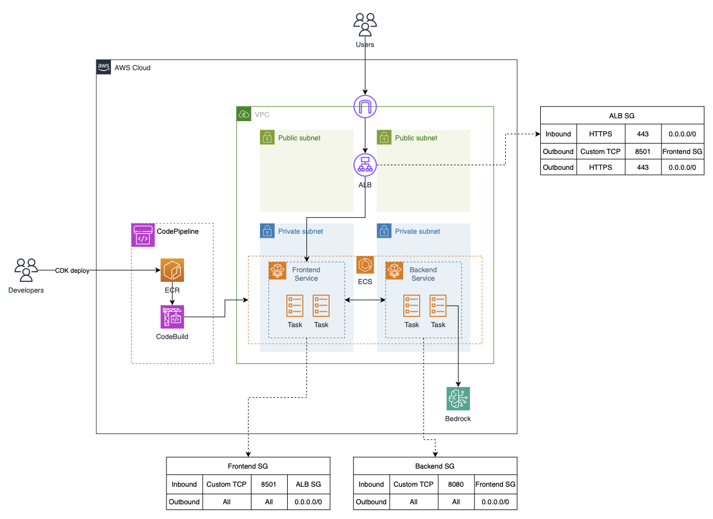

# Amazon Bedrock Demo Running on ECS

This example shows how to build the infrastructure and run an Amazon Bedrock application on the AWS cloud. The application is containerized and a system is built to run the application using Amazon ECS.




## Requirements

The following is necessary in order to build and deploy this example.

- Python 3.9 or above
- [AWS CLI](https://docs.aws.amazon.com/cli/latest/userguide/install-cliv2.html)
- [AWS CDK](https://docs.aws.amazon.com/cdk/v2/guide/getting_started.html)
- [Docker](https://www.docker.com/products/docker-desktop/) or [OrbStack](https://orbstack.dev/) (Because docker build runs from the CDK, Docker or OrbStack must be pre-installed on your build system.)


## AWS Services

The following AWS services are used to run this example.

- **Application Load Balancer (ALB)** Routing incoming traffic from outside to ECS
- **Elastic Container Registry (Amazon ECR)** storage for container image
- **Elastic Container Service (Amazon ECS)** container orchestration service
- **Amazon Bedrock** service that makes it easy to use foundation models
- **AWS CodePipeline** continuous delivery service
- **AWS CodeBuild** build service that compiles source code


## Deployment Instructions

1. Step into the project folder
```
cd bedrock-demo-running-on-ecs
```

2. Setting AWS_PROFILE

```shell
export AWS_PROFILE=<the configuration profile for aws-cli>
```

3. Create virtualenv

```shell
python3 -m venv .venv
source .venv/bin/activate
```

4. Install requirements

```shell
pip install -r requirements.txt
```

5. Deploy stack using CDK

Make sure Docker or OrbStack is running on the local machine 

```shell
cdk deploy GenAIDemo
```

## Limitations

The example presented here shows how to get an Amazon Bedrock application up and running on ECS. For real production deployments, security, observability, reliability, etc. must be considered.

## Security

See [CONTRIBUTING](CONTRIBUTING.md#security-issue-notifications) for more information.

## License

This library is licensed under the [MIT-0](LICENSE) License. See the LICENSE file.

